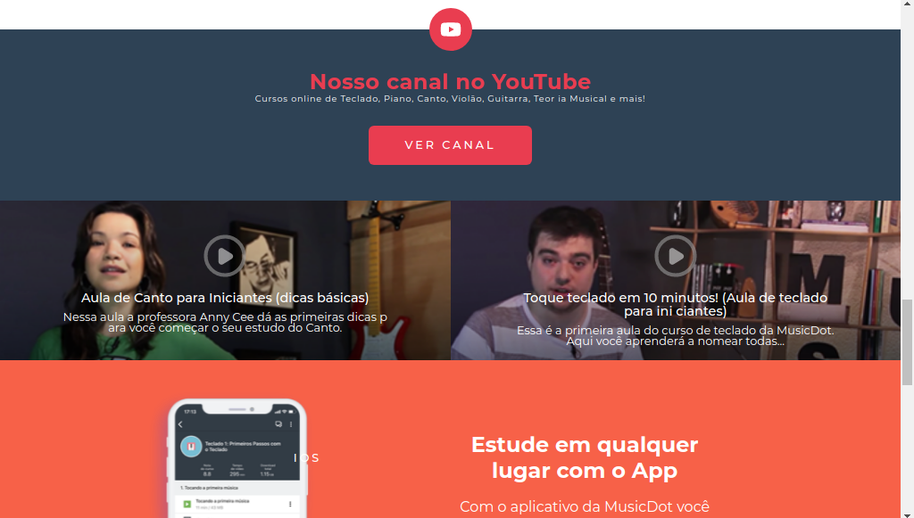

## Music Dot

<h4 align="center"> 
	🚧  Music Dot é um projeto proposto pela Caelum ,um site de aulas de musica totalmente responsivo , adapto para todos os tipos de telas , sua realização foi para o aperfeiçoamento e prática HTML5,CSS3, JS, Bootstrap.css, Bootstrap.JS, JQuery, UX|UI, First Mobile.  ✔️ 🚧
</h4>

## 💻 Sobre o projeto

:smiling_face_with_three_hearts: :notes: Music Dot? - O projeto apresenta uma plataforma de apresentação do site , onde mostra todos os instrumentos a qual a escola Music Dot oferece, logo em seu Layoult.

Temos na página principal a apresentação e beneficios do curso, cards com os valores.

Inserção de video de apresentação, e videos contidos no canal do youtube , onde o mesmo possui um botão para direcionamento até a plataforma do Youttube. 

E para finalizar a uma página de matriculas onde com o JavaScript temos a soma dos cursos escolhidos , e direcionamento para realização da matricula  

 :guitar: :musical_note: :notes: :microphone: :musical_keyboard: :drum:

## :bulb: Ideia do Projeto

```bash
Práticas e aperfeiçoamento de Front-End

```
## 🖼 Screenshot das telas da aplicação 

## 🖼 Tela principal da plataforma Music Dot 

  


## 🖼 Tela da apresentação dos videos página do Youtube. 

<br>
 
<br>

## 🖼 Tela da soma de cursos escolhidos para a realização da matricula.  

<br>
 
<br>

 # :four_leaf_clover::computer: Como rodar

```bash

https://givicking.github.io/projeto-musicdot/

```

## :100: :information_desk_person: Autora

<table align="center">
    <tr>
        <td align="center">
            <a href="https://github.com/GiVicking">
                
                <br />
                <sub><b>Gislaine Carvalho</b></sub>
            </a>
        </td>    
    </tr>
</table>
<h4 align="center">
   Feito com 💜 by  <a href="https://www.linkedin.com/in/gislaine-carvalho-040ab61a4/" target="_blank"> Gislaine Carvalho </a>
</h4>

